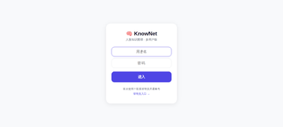

# 🧠 KnowNet — AI-Powered Personal Knowledge Graph

> Screenshot a WeChat profile. Paste a business card photo. KnowNet extracts who they are, what they do, and **automatically builds your 6-degree network**.
>
> Like Monica, but you never type a single field.

[](LICENSE)
[](https://www.python.org/)
[](https://flask.palletsprojects.com/)

<p align="center">
  
</p>

---

## 🤔 Why KnowNet?

You meet dozens of people every month — at dinners, conferences, through mutual friends. You take screenshots of WeChat profiles, snap business cards, jot down notes. And then... you forget.

Existing tools like [Monica](https://github.com/monicahq/monica) (25k ⭐) require you to **manually fill 10+ fields per contact**. By person #50, you give up.

**KnowNet takes a different approach:**

| | Monica | KnowNet |
|---|---|---|
| Data Entry | Manual form-filling | 📸 Screenshot → AI extracts everything |
| WeChat Support | ❌ | ✅ Native screenshot parsing |
| Auto-tagging | ❌ | ✅ Hometown, school, company, interests |
| Knowledge Graph | ❌ | ✅ Auto-links people with shared tags |
| 6-Degree Search | ❌ | ✅ BFS shortest path between any two people |
| Mobile UX | Desktop-first | 📱 Mobile-first PWA |
| Deployment | PHP + MySQL + Composer | 🐍 Python + SQLite (1 command) |

---

## ⚡ How It Works

```
📸 Take a screenshot → 🤖 Zhipu GLM-4V reads it → 🧠 DeepSeek extracts structured data
                                                              ↓
                                           🏷️ Auto-tags (hometown, school, company, interests)
                                                              ↓
                                           🔗 Auto-links people sharing the same tags
                                                              ↓
                                           🔍 Now you can search "find all Jiangxi alumni"
                                              or "how do I reach Person B through my network?"
```

---

## 🚀 Quick Start

### Prerequisites
- Python 3.10+
- A [DeepSeek API key](https://platform.deepseek.com/) (for text extraction)
- A [Zhipu API key](https://open.bigmodel.cn/) (for image OCR — GLM-4V)

### 1. Clone & Install

```bash
git clone https://github.com/YOUR_USERNAME/knownet.git
cd knownet
pip install -r requirements.txt
```

### 2. Set API Keys

```bash
# DeepSeek key (text extraction)
echo "sk-your-deepseek-key" > ~/.ds_key

# Zhipu key (image OCR) — set as env var, never commit to repo:
export ZHIPU_KEY="your-zhipu-key"
```

### 3. Run

```bash
python app.py
# → http://localhost:8200
```

### 4. Deploy with Nginx + SSL

```nginx
server {
    listen 443 ssl;
    server_name your-domain.com;

    location / {
        proxy_pass http://127.0.0.1:8200;
        proxy_set_header Host $host;
        proxy_set_header X-Real-IP $remote_addr;
    }
}
```

```bash
sudo certbot --nginx -d your-domain.com
```

---

## 📡 API Endpoints

| Method | Endpoint | Description |
|--------|----------|-------------|
| `GET` | `/api/persons?q=keyword` | Search all contacts |
| `GET` | `/api/person/:id` | Get person detail + relations |
| `POST` | `/api/person` | Add person (multipart: `image` + `text`) |
| `GET` | `/api/search/tag?name=hometown` | List tag values (e.g., all hometowns) |
| `GET` | `/api/search/tag/:name/:value` | Get all people with a specific tag |
| `GET` | `/api/path/:a_id/:b_id` | Find shortest path between two people |

---

## 🗄️ Database Schema

```
persons — id, name, phone, raw_notes, extracted(JSON), timestamps
tags    — person_id, tag_name, tag_value (auto-generated)
relations — person_a_id, person_b_id, relation_type (auto-linked)
```

Pure SQLite. No PostgreSQL, no Redis, no Docker required. Back up one file.

---

## 🎯 Use Cases

- 🍽️ **Post-dinner networking**: Screenshot WeChat profiles → KnowNet remembers everything
- 🎓 **Alumni networks**: "Find all 暨南大学 alumni in my contacts"
- 💼 **Business development**: "Who do I know in the healthcare industry?"
- 🔗 **Warm introductions**: "What's the shortest path from me to Investor X?"
- 🏠 **Hometown connections**: "Show me all Jiangxi folks in my network"

---

## 🛠️ Tech Stack

- **Backend**: Python Flask + SQLite (WAL mode)
- **AI Pipeline**: Zhipu GLM-4V (OCR) → DeepSeek (structure extraction)
- **Graph Algorithm**: BFS with max depth 6 (Six Degrees of Separation)
- **Frontend**: Vanilla HTML/CSS/JS, mobile-first PWA
- **Deployment**: Systemd + Nginx + Let's Encrypt

---

## 📝 Roadmap

- [ ] CSV/WeChat contact export import
- [ ] Chat history OCR (paste conversation → extract key facts)
- [ ] Periodic reminder: "Haven't talked to X in 3 months"
- [ ] Relationship strength scoring based on interaction frequency
- [ ] i18n (English UI)

---

## 📄 License

MIT — use it, fork it, build on it.

---

---

# 🇨🇳 中文说明

## KnowNet（人脉知识图谱）—— AI 驱动的个人关系管理

> 饭局回来，微信截图一贴，AI 自动读完、打好标签、织好关系网。从此再也不会忘了"这人是谁来着"。

**和 Monica 最大的区别：你不需要手动填任何一个字段。**

### 核心能力

1. **📸 截图即入库** — 微信名片截图、聊天记录、名片照片 → 智谱 GLM-4V OCR → DeepSeek 结构化提取
2. **🏷️ 自动打标签** — 家乡、学校、公司、行业、兴趣，全部自动归类
3. **🔗 知识图谱自动织网** — 同一个学校、同一个家乡的人自动关联
4. **🔍 六度人脉寻路** — "我和李总之间隔了几个人？最短路径是什么？"
5. **📱 手机优先** — 专为手机浏览器设计的 PWA，添加到主屏幕就是 APP

### 为什么造这个？

中国式社交极度依赖微信，但微信没有"CRM"功能。饭局加了微信，三个月后翻聊天记录想不起对方是谁、做什么的、哪个学校的校友。

Monica（GitHub 2.5 万星）是好产品，但它假设你会打开电脑、填表单。在中国，没人会这么干。

KnowNet 的答案是：**截图 → AI → 自动入库**。零手动。

### 快速部署

```bash
git clone https://github.com/YOUR_USERNAME/knownet.git
cd knownet
pip install -r requirements.txt
echo "sk-你的deepseek-key" > ~/.ds_key
python app.py
# 访问 http://localhost:8200
```

### 作者

[@负重进化论](https://mp.weixin.qq.com/) — 独立 AI 部署顾问，前广电网络副总，15 年产业经验。KnowNet 是我自己用了两周、确认离不开之后，决定开源出来的工具。

有问题？提 Issue。想交流？公众号《负重进化论》后台留言。
